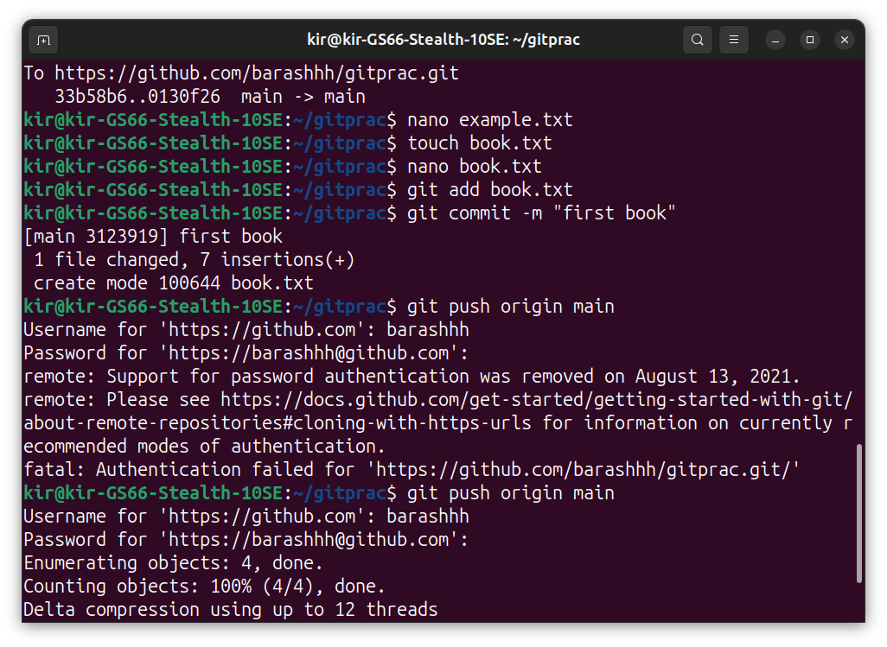
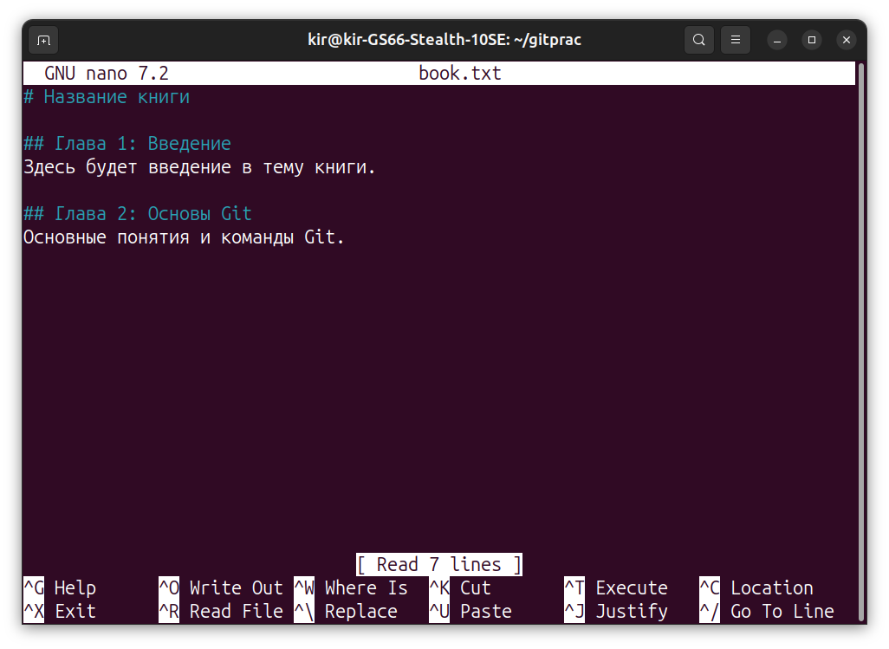
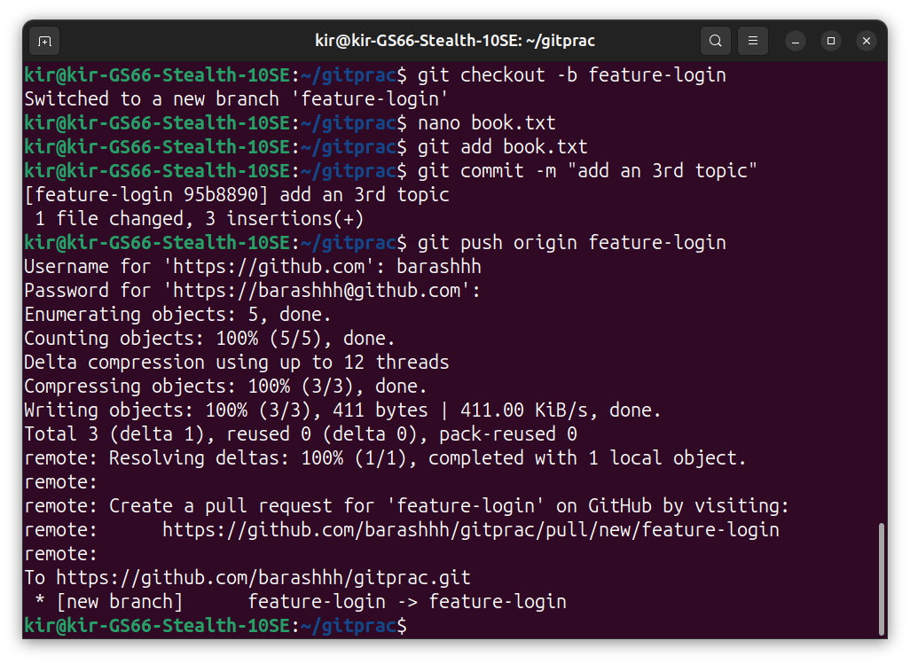
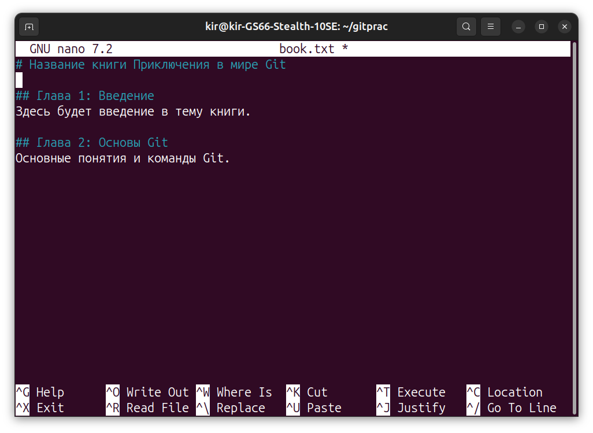
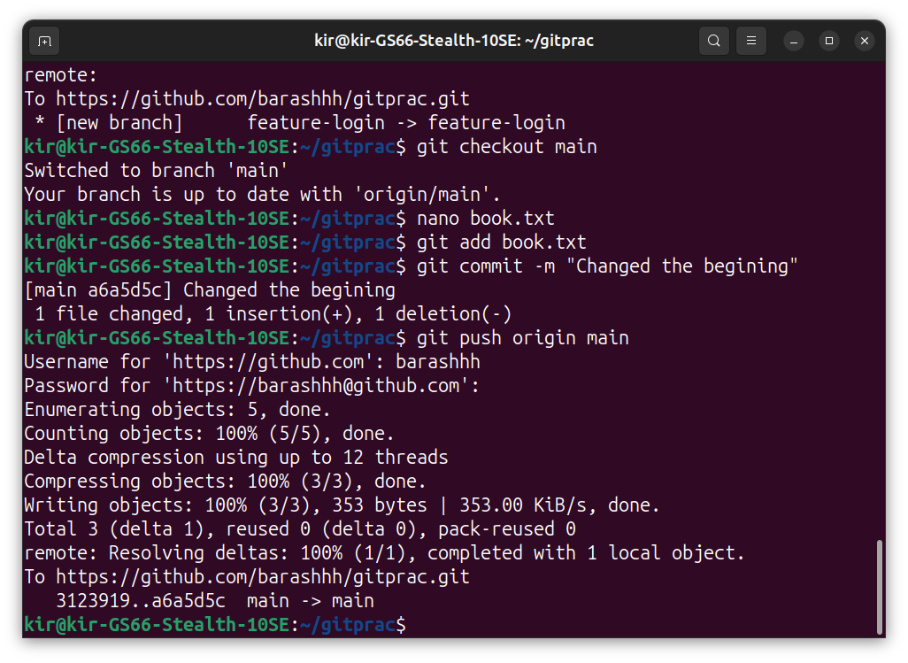
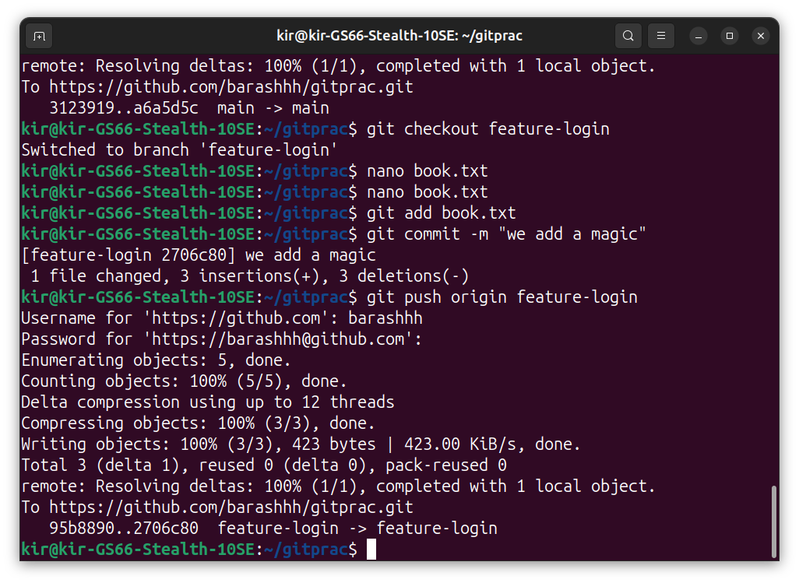
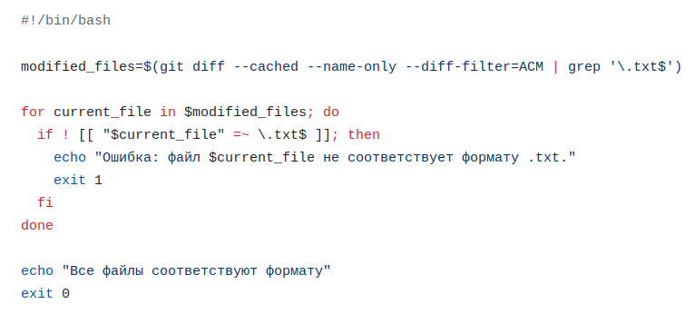

# Отчет по 5-ой лабе by Stepanov Kirill  
создали репозиторий и сделали там файл с помощью touch,  
потом его форматнули через nano
  
добавили текста
 
Новая ветка, новый текст  
  
Работа с ветками просто создаем новую и туда заливаем изменения
  
Создаем конфликт.
  
  

А так же баш скрипт, который должен делать автоматические проверки формата файлов при коммите  

